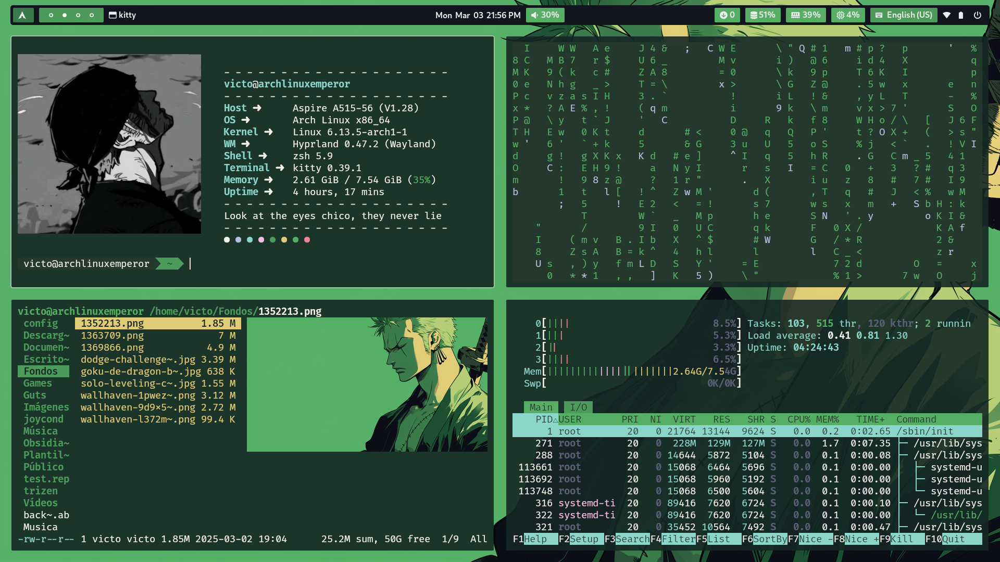
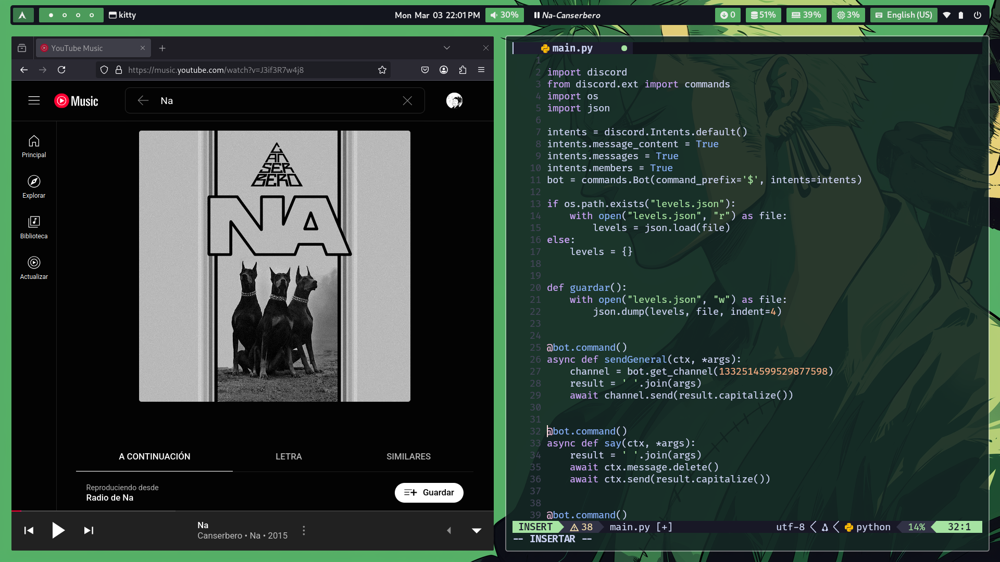
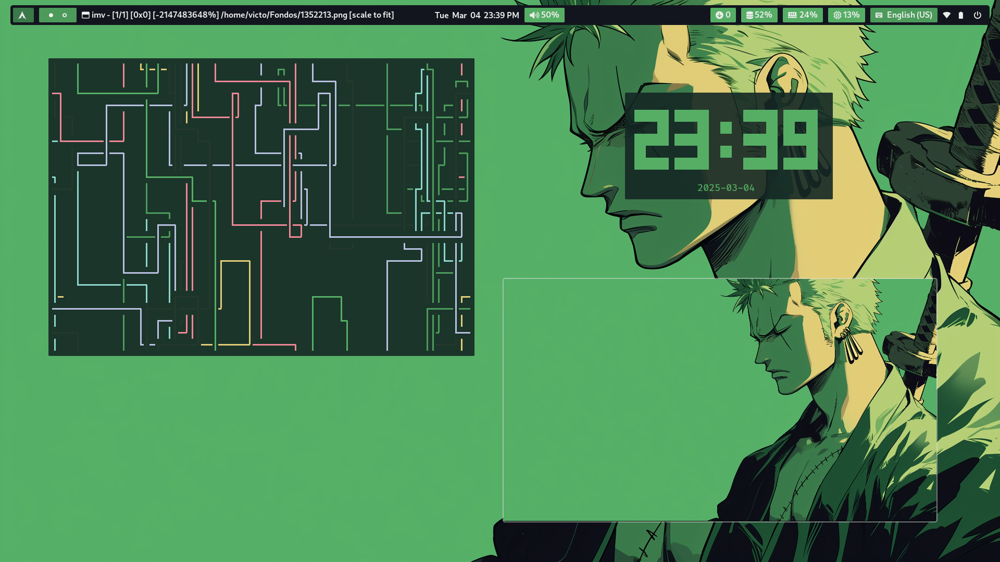

- Waybar: Barra superior
- Cava: Visualizador
- Fastfetch: Informacion del sistema
- Hyprland: compositor de wayland
- Ranger: Explorador de achivos de terminal
- Imv: Visualizador de imagenes
- Waypaper: gestor de fondo de pantalla
- Swww y waypaper: gestores del fondo de pantalla
- Dunst: Notificaciones
- Grim: Captura de pantalla (screenshot tool)
- Htop: listar los procesos y ver consumo del sistema
- Fuente: FiraCode Nerd Fonts
- Rofi: Menu
- Kitty: Emulador de terminal

## Screenshots

